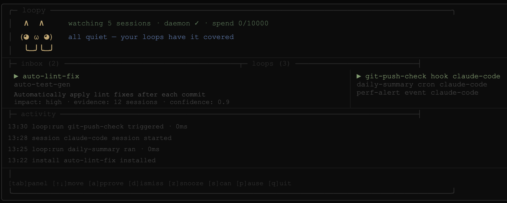

<p align="center">
  
</p>

<p align="center">
  <strong>loopEng watches what you do by hand in your terminal and turns the steps you keep repeating into callable MCP tools — so your AI agents can do them for you.</strong>
</p>

---

## What is loopEng?

loopEng is a **local meta-agent** that runs quietly in your terminal alongside Claude Code and Codex. It:

1. **Watches** your coding sessions as they happen.
2. **Finds** the workflows you keep doing by hand.
3. **Proposes** them to you in a terminal dashboard.
4. On your approval, **turns each one into**:
   - a **loop** — `loop.md` operating instructions wired into Claude Code or Codex, and
   - a **callable MCP tool** — the same workflow as a parameterized command sequence your agents can invoke directly.

You review proposals. You approve the ones that make sense. Everything stays on your machine — the only LLM calls go through your configured runner (`claude -p` by default). loopEng never phones home.

> *"True productivity isn't typing faster; it's stopping the need to type the same thing twice."*

---

## How it works

loopEng is a small local pipeline that runs continuously in the background:

```
Claude Code / Codex sessions
       │
       ▼
  [watcher]  — a launchd daemon notices each new session transcript
       │
       ▼
  [digester] — compresses + redacts each session to a compact text digest
       │
       ▼
  [engine]   — sends digests to your configured runner, looks for recurring patterns
       │
       ▼
  [inbox]    — strong candidates land as proposals; you review and approve
       │
       ├──▶ [loop]      — loop.md + trigger + manifest wired into Claude Code / Codex
       │
       └──▶ [mcp tool]  — the same workflow as a callable tool on the loopeng-tools server
```

Everything above runs on your machine. The engine uses your own Claude credits — no separate service, no subscription, no cloud component.

---

## Install

```bash
curl -fsSL https://raw.githubusercontent.com/issadevs/loopeng/main/install.sh | bash
```

The installer:
- clones the repo to `~/.loopeng-app`, runs `npm install` + `npm run build`, and links the `loopeng` binary to your PATH,
- installs the Fable 5 prompt to `~/.loopeng/prompts/fable.md` and the `/fable` command to `~/.claude/commands/fable.md`.

Re-running the same command updates an existing install to the latest version.

Then finish setup:

```bash
loopeng setup
```

`loopeng setup` writes `~/.loopeng/config.json`, installs a `SessionStart` trigger hook into `~/.claude/settings.json`, and installs + loads a launchd daemon (`com.loopeng.daemon`).

Options:

```bash
loopeng setup --companion manual   # configure companion mode (auto | manual | off)
loopeng setup --no-daemon          # configure without the background daemon
```

**Requirements:** Node ≥ 20, git, the Claude Code CLI (`claude`) in your PATH, macOS (the daemon uses launchd; Windows/Linux support is on the roadmap).

---

## The dashboard

```bash
loopeng
```

Running `loopeng` with no arguments opens the full-terminal hub:



The **header** shows your agent (loopEng) with live status: sessions watched · daemon state · today's token spend vs cap.

Three panels:

- **inbox** — pending proposals. Select one to see its summary, estimated impact, evidence count, and confidence score.
- **loops** — your installed loops, with trigger kind and target tool.
- **activity** — a scrolling log of everything loopEng has done in the background.

Keys:

| Key | Action |
|-----|--------|
| `tab` | Cycle focus: inbox → loops → activity |
| `↑` / `k`, `↓` / `j` | Move within the focused panel |
| `a` | Approve the selected proposal (confirm `y` / `n`) |
| `d` | Dismiss the selected proposal (confirm `y` / `n`) |
| `z` | Snooze the selected proposal for 7 days |
| `x` | Uninstall the selected loop (confirm `y` / `n`) |
| `s` | Trigger a scan now |
| `p` | Pause / resume the daemon |
| `q` | Quit |

The dashboard resizes with your terminal. At **60×16** and above it uses the full two-column layout; in tighter panes it switches to a compact one-panel view. In an interactive terminal, it uses a restrained color theme for status, focus, and actions; logs and non-TTY output stay plain, and `NO_COLOR=1` disables color.

---

## Commands

| Command | What it does |
|---------|--------------|
| `loopeng` | Open the full-terminal dashboard |
| `loopeng review` | Open the dashboard focused on the proposal inbox |
| `loopeng companion` | Alias for the bare `loopeng` command |
| `loopeng setup [--companion <mode>] [--no-daemon]` | Initialize config, trigger hook, and daemon |
| `loopeng scan` | Analyze local digests and surface new proposals now |
| `loopeng define <id> [--describe <text>] [--file <path>]` | Define a phased pipeline — from a plain-English description (AI), interactively, or JSON |
| `loopeng run <id> [--dry-run] [--restart]` | Run or resume a pipeline, driving the agent phase by phase |
| `loopeng pipelines` | List defined pipelines |
| `loopeng list` | List installed loops |
| `loopeng uninstall <id>` | Remove a loop and everything it installed |
| `loopeng pause` / `loopeng resume` | Pause / resume the background daemon |
| `loopeng status` | Show daemon state, today's token spend, and pending proposal count |
| `loopeng tools` | List the callable MCP tools generated from your workflows |
| `loopeng tools-register` | Register the `loopeng-tools` MCP server in Claude Code (`~/.claude.json`) |
| `loopeng mcp-register` | Register the `loopeng` control-surface MCP server in Claude Code |
| `loopeng forget <id>` | Delete a pipeline |
| `loopeng mcp-tools` | Run the `loopeng-tools` MCP server (stdio) |
| `loopeng mcp` | Run loopEng's control-surface MCP server (stdio) |
| `loopeng mark` | Drop a session marker (used by the trigger hook) |
| `loopeng daemon` | Run the watcher in the foreground |

---

## What an approved proposal produces

Each approved proposal becomes a **bundle** at `~/.loopeng/bundles/<id>/`:

```
loop.md          — operating instructions an agent reads and follows
trigger.json     — schedule, hook, or manual trigger metadata
manifest.json    — evidence, target tool, and every path the install touched
tool.json        — the workflow as a callable MCP tool (best-effort; see below)
state/           — loop-local state (persists across runs)
```

`manifest.json` records every path the install created, which is what makes `loopeng uninstall <id>` exact — it removes only those paths, with no guesswork.

The `loop.md` is generated by a **maker → checker** pass: the maker writes six fixed sections (Responsibility, Trigger & cadence, Procedure, Verification, Convergence, Escalation) plus a trigger block, and the checker rejects vague verification, missing caps, or invented tools before the bundle is written.

---

## Pipelines — drive Claude through defined phases

Some work is a recurring *sequence*: you tell the agent what to build, then "now test", then "refactor", then "open a PR" — each step waiting on the last. A **pipeline** captures that as phases you define, and loopEng pilots the agent through them **one phase at a time**, checking a gate before advancing.

The fastest way is to **describe it in plain English** — loopEng drafts the phases for you (and infers gates from your project's scripts), then you confirm:

```bash
loopeng define ship-feature --describe "implement the change, test until green, refactor, open a PR"
```

You can also define one interactively (`loopeng define ship-feature`, answering a phase at a time), inspect it (`loopeng pipelines ship-feature`), preview it (`loopeng run ship-feature --dry-run`), or hand-write the JSON:

```json
{
  "description": "ship a feature end to end",
  "phases": [
    { "name": "implement", "instruction": "Implement the requested change." },
    { "name": "test",       "instruction": "Run the tests and fix any failures.", "gate": ["npm", "test"], "maxAttempts": 3 },
    { "name": "refactor",   "instruction": "Clean up the implementation; tests must stay green.", "gate": ["npm", "test"] },
    { "name": "pr",         "instruction": "Open a pull request summarizing the change." }
  ]
}
```

```bash
loopeng define ship-feature --file ship.json
loopeng run ship-feature          # runs the agent per phase; advances only when the gate passes
loopeng run ship-feature          # if it stopped, re-running resumes at the stuck phase
loopeng run ship-feature --restart   # start over from phase 1
```

- A **gate** is an `argv` command run with `execFile` (no shell); exit 0 advances. On failure the phase re-runs up to `maxAttempts`, with the gate's output fed back to the agent so it can fix the issue.
- loopEng persists progress between phases, so a stopped or interrupted run **resumes where it left off**.
- Gates can't be a shell/interpreter (`bash`, `python`, …) — same guard as generated tools.

---

## From workflow to callable MCP tool

A `loop.md` is prose an agent **reads and follows**. The next step is a tool an agent **calls and runs**. On approval, loopEng also tries to synthesize a `tool.json` — the same workflow as a parameterized sequence of `argv` commands — and exposes it on the **`loopeng-tools`** MCP server.

The synthesis is **grounded in what you actually did**:

- loopEng resolves the proposal's evidence back into the **real command lines** from your sessions,
- infers parameters from the tokens that **varied across runs** (e.g. a branch name),
- and a **deterministic gate rejects any step whose command you were never observed running** — so a generated tool can't invent `kubectl` because the model felt like it.

```bash
loopeng tools            # list the callable tools loopEng has generated
loopeng tools-register   # register the loopeng-tools server in Claude Code
loopeng mcp-tools        # run the loopeng-tools MCP server (stdio)
```

Once registered, an agent session can call e.g. `deploy_staging(branch="main")` and loopEng runs the captured steps.

**Safety.** Generated tools never run through a shell. Each step is an `argv` array executed with `execFile`, and parameter values are substituted as single literal tokens — so a value like `main; rm -rf /` is passed verbatim as one argument, never interpreted. Each step runs with a timeout (120s) and bounded output. A tool exists only because **you** approved the proposal it came from.

---

## MCP servers

loopEng ships two MCP servers, both stdio:

### `loopeng mcp` — control surface

Lets an agent drive loopEng itself. Register it with `loopeng mcp-register` (writes `{ "mcpServers": { "loopeng": { "command": "loopeng", "args": ["mcp"] } } }` into `~/.claude.json`), or `claude mcp add loopeng -- loopeng mcp`.

- **Tools:** `proposals_list`, `proposals_get`, `proposals_approve`, `proposals_dismiss`, `proposals_snooze`, `scan`, `loops_list`, `loops_uninstall`, `events`, `status`, `pipelines_list`, `pipeline_show`, `pipeline_define`, `pipeline_run`
- **Resources:** `loopeng://proposals/{id}`, `loopeng://events`, `loopeng://status`

### `loopeng mcp-tools` — your workflows as tools

Exposes every installed loop that has a `tool.json` as a callable tool. When none exist yet, it exposes a single `loopeng_tools_help` tool that explains how to generate one. `loopeng tools-register` adds it to `~/.claude.json` as:

```json
{ "mcpServers": { "loopeng-tools": { "command": "loopeng", "args": ["mcp-tools"] } } }
```

---

## Use loopEng from Claude Code

Two ways, depending on whether *you* or the *agent* drives it:

**As a CLI — run any command from your shell.** The `loopeng` binary is on your PATH, so you can run it anywhere, including straight from the Claude Code prompt with the `!` prefix:

```
! loopeng status
! loopeng scan
! loopeng pipelines
! loopeng run ship --dry-run
! loopeng define ship --describe "implement the change, test until green, open a PR"
```

(In a dev checkout without a global install, use `npm run dev -- <command>`.)

**As an MCP server — let the Claude Code agent drive loopEng.** Register the control surface once:

```bash
loopeng mcp-register          # or: claude mcp add loopeng -- loopeng mcp
```

Now, inside a Claude Code conversation, you can just ask — the agent calls loopEng's tools:

- *"scan my sessions and list the loop proposals"* → `scan`, `proposals_list`
- *"approve proposal `verify-before-handoff`"* → `proposals_approve`
- *"define a pipeline `ship` that implements, tests, then opens a PR"* → `pipeline_define`
- *"dry-run the `ship` pipeline"* → `pipeline_run` (with `dryRun`)

> A real `pipeline_run` executes one agent run per phase and can take a while; prefer the CLI for long runs, and `dryRun` to preview from within a conversation.

---

## Privacy & security

Transcripts stay on your machine. Always. loopEng never contacts an external service of its own — the only network egress is whatever your own `claude` / `codex` CLI does.

**What leaves your machine, and where it goes.** During a scan, loopEng builds compact digests of your sessions (commands, messages, errors) and sends them to **your configured runner** (`claude -p` by default) so it can propose loops. With `scope: "project"` only the current project's sessions are included; with `scope: "all"` (default) every project on the machine is. Set the scope to match how much you want analysed.

**Secret redaction (best-effort).** Before a digest is sent or written, loopEng redacts:

- Private key blocks (`-----BEGIN … PRIVATE KEY-----`)
- API keys/tokens with known prefixes (`sk-`, `ghp_`, `gho_`, `ghs_`, `github_pat_`, `xoxb-`, `xapp-`, …), AWS keys (`AKIA…`), Google keys (`AIza…`), JWTs (`eyJ…`), and `Bearer` tokens
- `key=value` / `key: value` pairs with a credential-ish key (`password`, `secret`, `token`, `api_key`, …)
- URL credentials (`//user:pass@host`) and high-entropy strings

Redaction is pattern-based and **not guaranteed** — a low-entropy or all-lowercase secret (e.g. a bare hex token) can slip through. Treat digests as sensitive.

**On-disk.** State under `~/.loopeng` (digests and generated loops) is written owner-only (`0600` files, `0700` directories). JSON state reads are capped before parsing to avoid loading unexpectedly huge config/registry/proposal files.

**Running approved loops is code execution.** Approving a proposal can install an automation that runs on a schedule or on Claude Code events:

- Tool specs (`loopeng-tools`) execute via `execFile` (no shell); a generated command naming a shell/interpreter (`bash`, `sh`, `python`, `node`, …) as `argv[0]` is **rejected**, and parameter values can't inject extra commands.
- Loop bundles run your configured runner with the loop prompt — an **autonomous agent with that runner's permissions**. Review what you approve; only approve loops whose actions you understand.

---

## Configuration & on-disk layout

Configuration lives at `~/.loopeng/config.json`:

```json
{
  "companion": "auto",
  "dailyTokenCap": 100000,
  "pollIntervalMin": 15,
  "runnerCommand": "claude",
  "runnerArgs": ["-p"],
  "runnerTimeoutMs": 120000,
  "claudeProjectsDir": "~/.claude/projects",
  "codexSessionsDir": "~/.codex/sessions",
  "scope": "all",
  "recentWindowHours": 4,
  "scanMaxAttempts": 1,
  "scanMaxDigestChars": 60000,
  "eventsMaxBytes": 524288,
  "eventsKeepLines": 1000,
  "mcpToolStepTimeoutMs": 120000,
  "mcpToolMaxOutputBytes": 262144,
  "dashboardBusyTickMs": 333,
  "dashboardRefreshMs": 5000,
  "watcherMarkerDebounceMs": 2000,
  "pipelineMaxPhases": 30,
  "pipelineMaxInstructionChars": 8000,
  "pipelineMaxGateArgv": 32,
  "pipelineMaxAttempts": 10,
  "pipelineDefaultMaxAttempts": 1,
  "pipelineGateTimeoutMs": 120000,
  "pipelineGateMaxOutputBytes": 1048576
}
```

- **companion** — `auto` (open a companion window when work is found), `manual`, or `off`
- **dailyTokenCap** — the engine reserves a conservative estimate before each scan and skips once the day's budget is spent
- **pollIntervalMin** — how often the daemon re-scans for new sessions
- **runnerCommand** / **runnerArgs** / **runnerTimeoutMs** — runner binary, flags, and timeout used for engine scans and Claude Code loop installs. Add model or permission flags here, e.g. `["-p", "--model", "claude-sonnet"]`.
- **claudeProjectsDir** / **codexSessionsDir** — transcript roots. `~` is expanded.
- **scope**, **recentWindowHours**, **scanMaxAttempts**, **scanMaxDigestChars** — scan scope, active-session window, retry count, and max digest payload.
- **eventsMaxBytes** / **eventsKeepLines** — event log rotation threshold and retained line count.
- **mcpToolStepTimeoutMs** / **mcpToolMaxOutputBytes** — timeout and output cap for generated MCP tools.
- **dashboardBusyTickMs** / **dashboardRefreshMs** / **watcherMarkerDebounceMs** — UI refresh and watcher debounce intervals.
- **pipelineMaxPhases** / **pipelineMaxInstructionChars** / **pipelineMaxGateArgv** — validation caps when defining a pipeline.
- **pipelineMaxAttempts** / **pipelineDefaultMaxAttempts** — upper bound and default for a phase's retry count.
- **pipelineGateTimeoutMs** / **pipelineGateMaxOutputBytes** — per-gate command timeout and output buffer cap.

Environment overrides:

- `LOOPENG_RUNNER_COMMAND`, `LOOPENG_RUNNER_ARGS`, `LOOPENG_RUNNER_TIMEOUT_MS`
- `LOOPENG_JSON_READ_MAX_BYTES` (default `8388608`)
- `LOOPENG_CLAUDE_PROJECTS_DIR`, `LOOPENG_CODEX_SESSIONS_DIR`
- existing one-off scope overrides: `LOOPENG_SCOPE`, `LOOPENG_PROJECT`

Everything loopEng writes lives under `~/.loopeng/`:

```
~/.loopeng/
├ config.json        — the config above
├ digests/           — one redacted text digest per session
├ proposals/         — one JSON file per proposal
├ bundles/<id>/      — generated bundles (loop.md, trigger.json, manifest.json, tool.json, state/)
├ registry/          — installed.json, dismissed.json
├ markers/           — session-start markers dropped by the trigger hook
├ prompts/fable.md   — the Fable 5 system prompt
└ log/               — events.jsonl, spend.json, watch.json, pattern-memory.txt
```

---

## /fable — Claude Fable 5 slash command

The installer drops a `/fable` slash command into `~/.claude/commands/`, available in **any** Claude Code session:

```
/fable <your prompt>
```

It routes your prompt through the full Claude Fable 5 system prompt and model, inline, without leaving your session or switching your model. Under the hood it spawns:

```
claude -p --model claude-fable-5 --system-prompt-file ~/.loopeng/prompts/fable.md
```

and returns the output inline.

---

## The never-guilt principle

loopEng may suggest automation, but it never shames you for ignoring, snoozing, or dismissing a proposal. A quiet tool beats a nagging one. Your inbox, your call.

---

## Development

```bash
git clone https://github.com/issadevs/loopeng.git
cd loopeng
npm install
npm run build
npm link
```

Scripts:

```bash
npm run build       # tsc → dist/
npm run typecheck   # tsc --noEmit
npm test            # vitest run
npm run dev         # tsx src/index.ts
```

Run the full check the way CI does:

```bash
npm run typecheck && npm test
```

---

*loopEng is early software. It watches Claude Code and Codex sessions on macOS via launchd. Windows/Linux daemon support is on the roadmap.*
